# Penalty-based Boundary Intersection approach        PBI approach

このスカラー化関数の等高線は重みベクトルで曲がります．  
パラメータθの値によって等高線が曲がる角度が変わります．  
θ=0のとき等高線は曲がらず直線になります.  
θ=1のとき等高線は直角に曲がります.  

## image  
|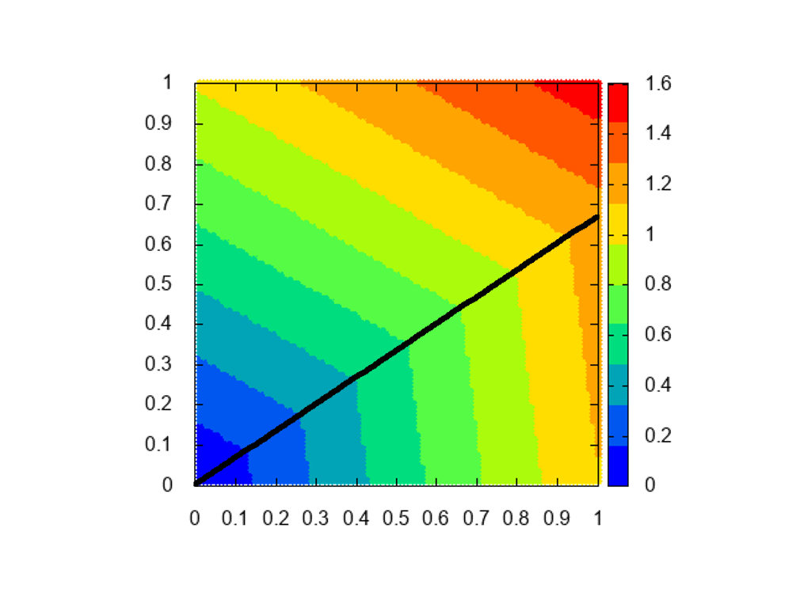|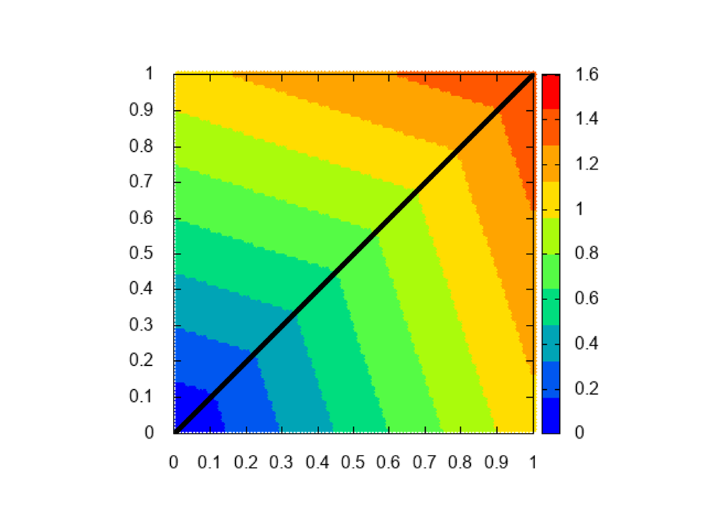|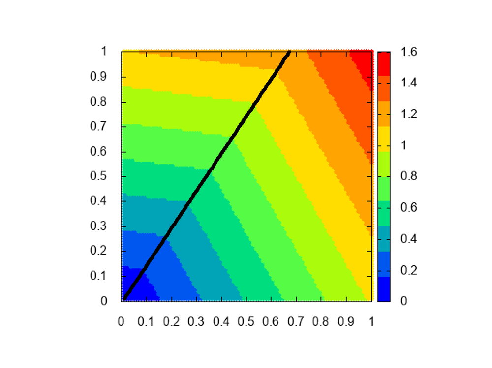|
|---|---|---|
|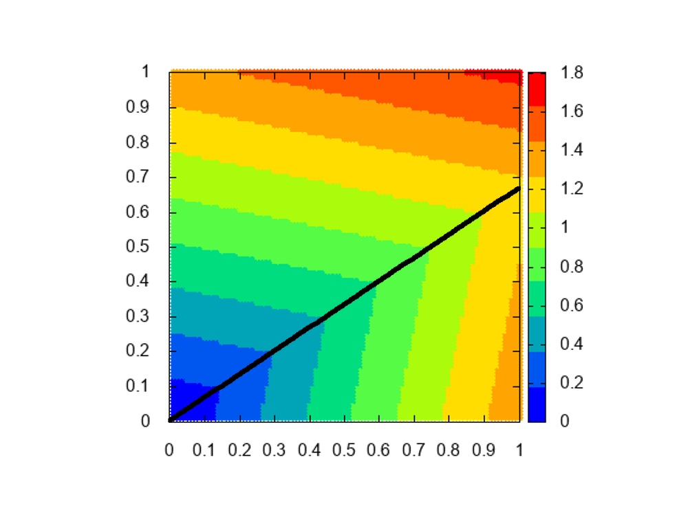|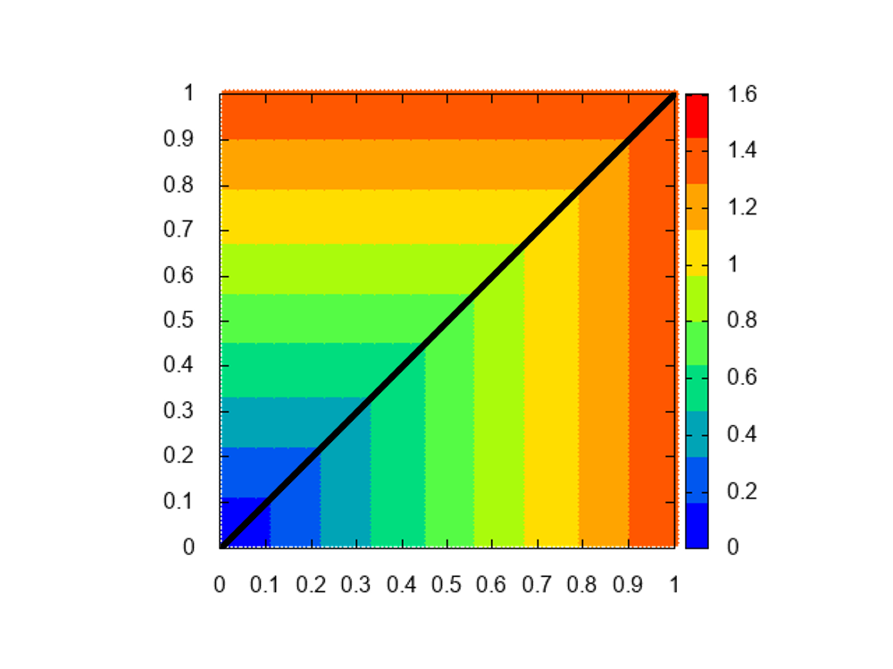|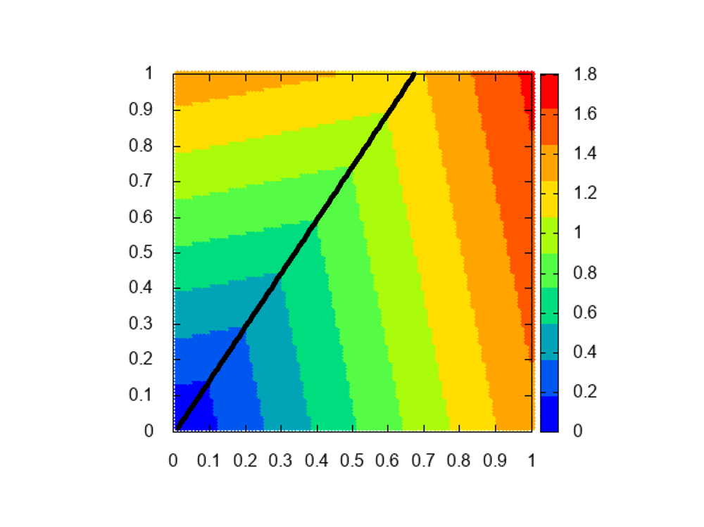|
|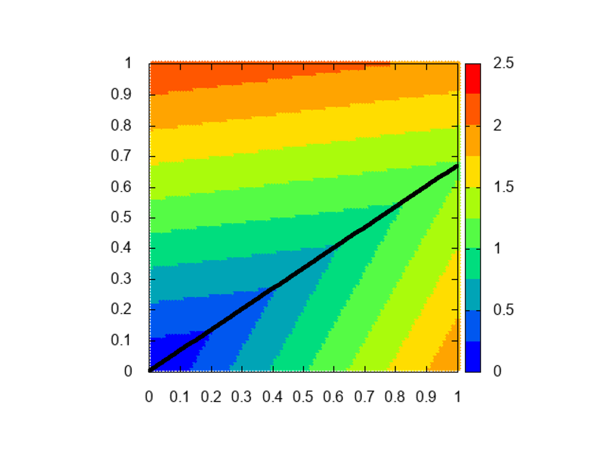|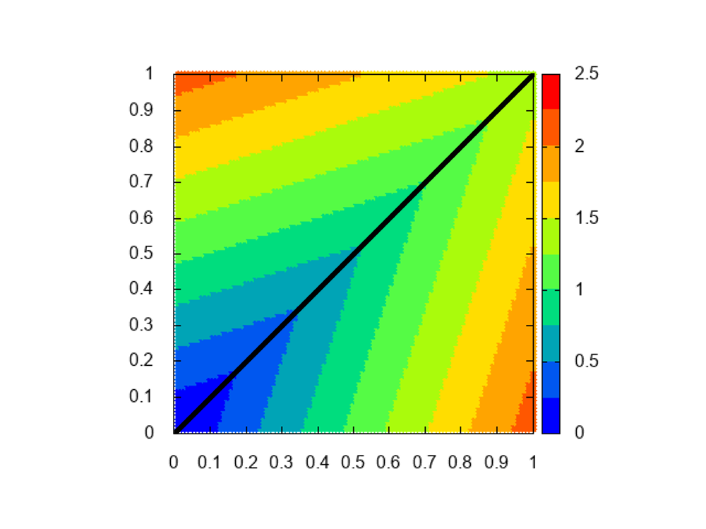|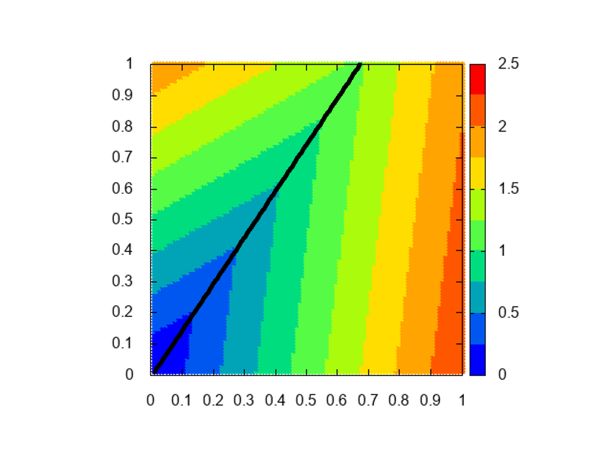|
|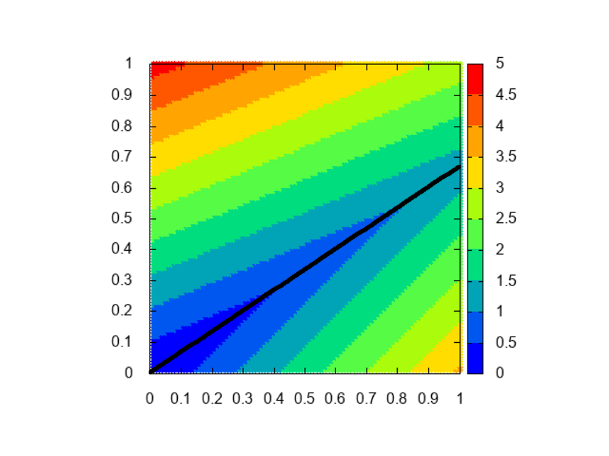|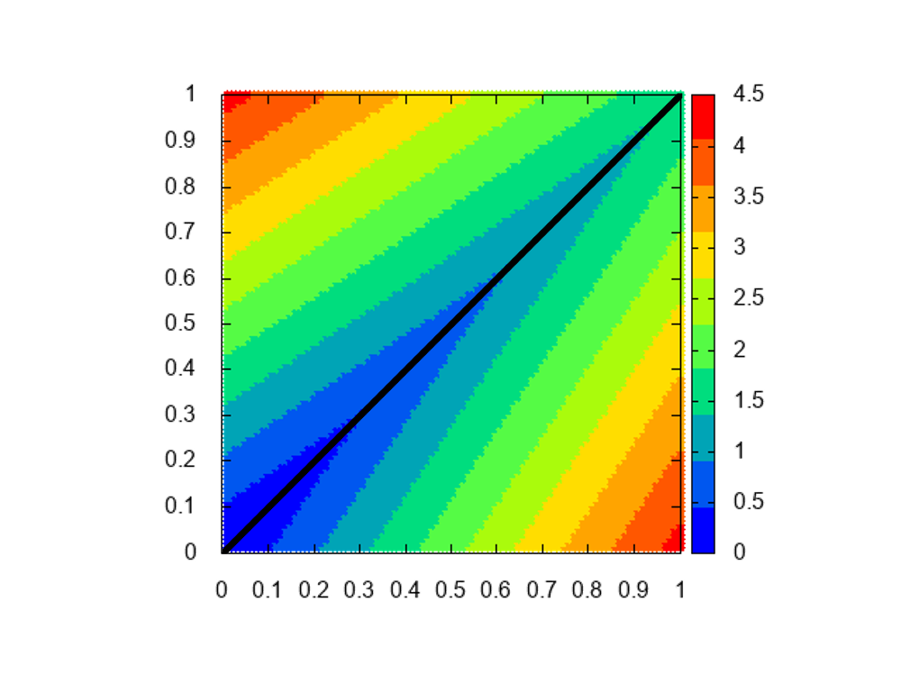|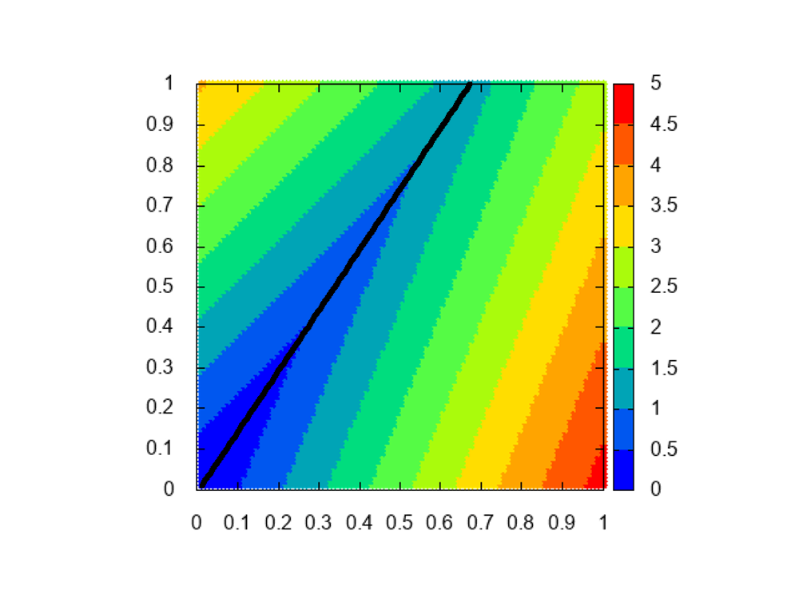|
