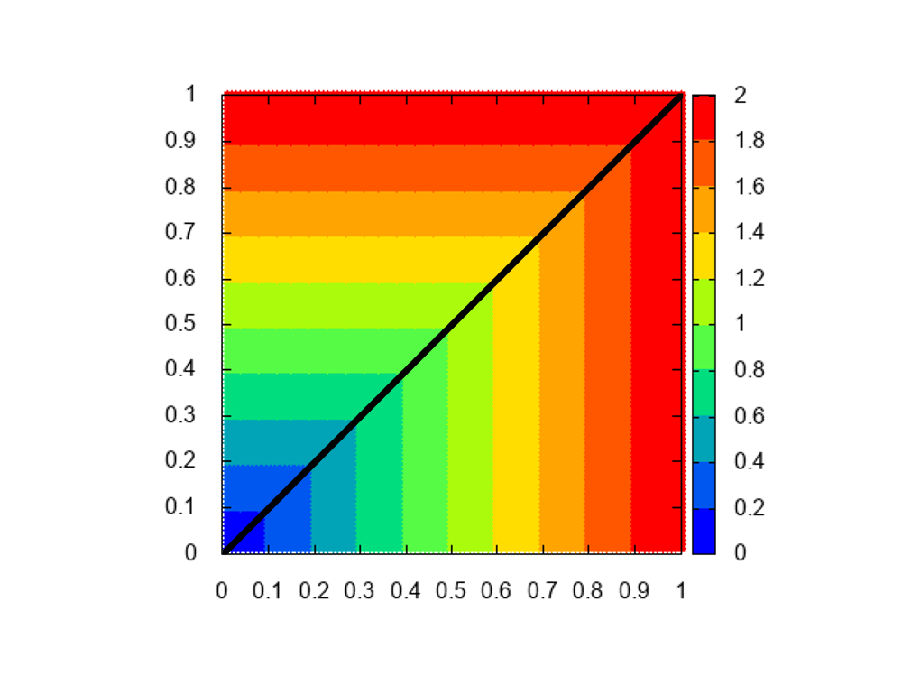

# Reciprocal Tchebycheff approach        rTCH approach

このスカラー化関数の等高線は目的関数値に平行で，重みベクトルで直角に曲がります．  
TCHは重みベクトルを乗算するのに対し，rTCHは重みベクトルで除算します．  
TCHよりスカラー化関数値のスケールが大きくなっています．  

## image  
||||
|---|---|---|
